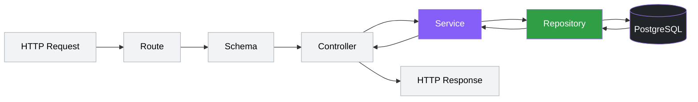
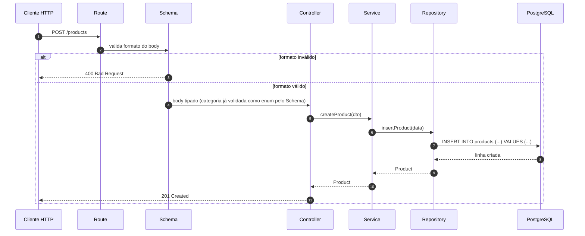
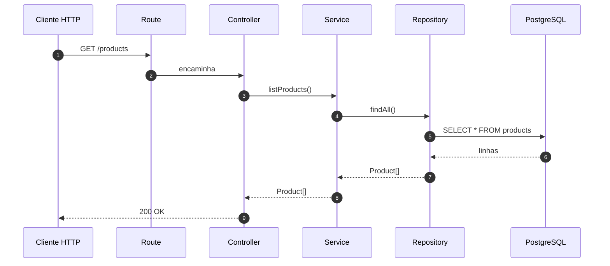
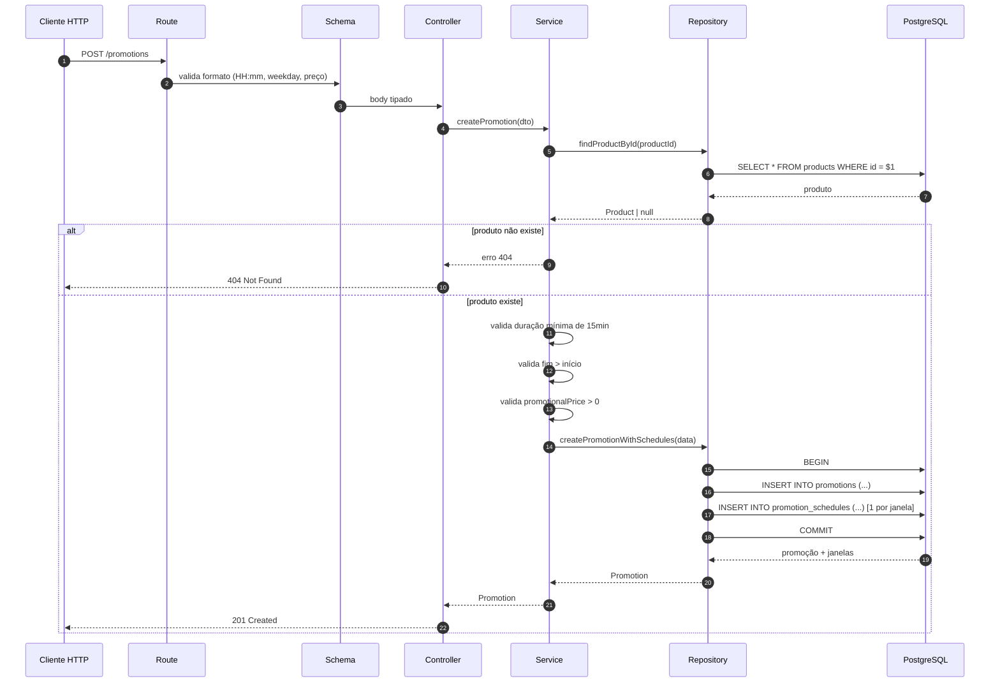
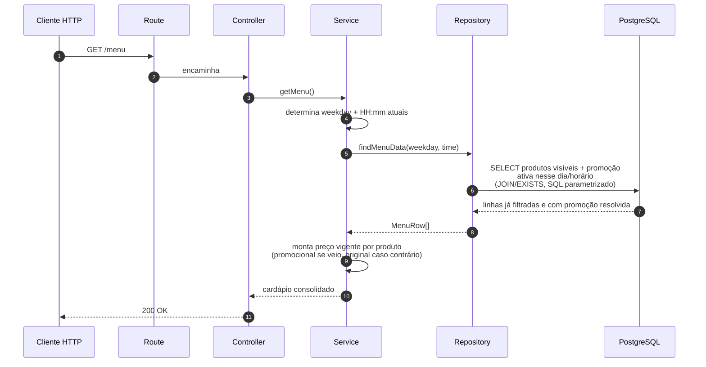

# Data Flow — Goomer Menu API

Este documento descreve o fluxo **técnico**: da requisição HTTP até o PostgreSQL e de volta. Para o fluxo de negócio (o que o sistema faz, sem código), veja [`user-flow.md`](./user-flow.md).

## Camadas e limite de responsabilidade

| Camada | Responde | Não responde |
|---|---|---|
| **Route** | Qual método + endpoint chama qual controller? | Formato dos dados, regra de negócio |
| **Schema** | Os dados têm o *formato* esperado? (`HH:mm`, número positivo, enum válido) | Se a promoção *deveria* estar ativa agora |
| **Controller** | Traduzir `req`/`res` em chamada de aplicação | Qualquer `if` de negócio |
| **Service** | Toda regra de negócio: visibilidade, janela de promoção, cálculo de preço vigente | Como o SQL é escrito |
| **Repository** | Executar SQL parametrizado e devolver dados | Decidir se um dado deve ou não aparecer |
| **PostgreSQL** | Persistir e recuperar | — |

A regra que mantém isso saudável ao longo do projeto **não é** "todo `if` no Repository é errado" — Repository pode e deve ter `JOIN`, `WHERE`, `EXISTS` e lógica de consulta o quanto for preciso para ser eficiente. A linha real é outra:

> **O Service define a política e o contexto do negócio; o Repository traduz essa necessidade em SQL eficiente.** Condições que existem só para estruturar a consulta (`EXISTS`, `JOIN`, paginação) pertencem ao Repository. Decisões que mudam a política do domínio (o que é "visível", o que conta como "promoção ativa", qual preço é o vigente) pertencem ao Service — mesmo que, na prática, virem parâmetros de uma cláusula `WHERE`.

---

## Visão geral da requisição



---

## POST /products — criar produto



---

## GET /products — listar (administrativo)



> Endpoint **administrativo**: retorna produtos visíveis *e* invisíveis, com preço original. Não confundir com `/menu`. Ordenação (`ORDER BY`) fica de fora por enquanto — é a funcionalidade opcional de "gerenciar ordenação dos produtos", ainda não decidida. Quando existir uma coluna de ordem, este `SELECT` ganha o `ORDER BY` correspondente.

---

## POST /promotions — criar promoção com janelas de horário



**Ponto crítico:** `promotions` + `promotion_schedules` são inseridos numa única transação. Se a inserção das janelas falhar, a promoção "solta" (sem horário) não pode sobrar no banco.

---

## GET /menu — o endpoint que resume o desafio



**Decisão de design deliberada, SQL a definir no ERD:** o filtro de visibilidade e o casamento de horário devem acontecer **dentro do SQL** (via `WHERE` + `JOIN`/`EXISTS`), não em loop no Service depois de trazer a tabela inteira — isso é mais rápido e usa índice. Isso não viola "Service decide, Repository traduz": quem calcula `weekday`/`time` e decide qual preço final expor continua sendo o Service; o Repository só recebe esses parâmetros e monta a consulta mais eficiente com eles.

Propositalmente **não** colocamos aqui o SQL literal do `JOIN` — a primeira tentativa (`LEFT JOIN promotions` + `LEFT JOIN promotion_schedules`) tem uma armadilha real: se a promoção existir mas nenhuma janela estiver ativa *agora*, um `pr.promotional_price` solto no `SELECT` pode vazar mesmo sem janela correspondente, aplicando desconto fora de horário. A query definitiva só deve ser escrita depois do `erd.md`, quando `PK`, `FK` e cardinalidade entre `products`, `promotions` e `promotion_schedules` estiverem fechadas — evita documentar um bug antes mesmo dele existir no código.

---

## Onde mora cada regra (referência rápida)

```mermaid
flowchart TD
    classDef schema fill:#f1f3f5,stroke:#adb5bd;
    classDef service fill:#845EF7,color:#fff;
    classDef repo fill:#2F9E44,color:#fff;

    A["Formato HH:mm é válido?"]:::schema
    B["Intervalo possui pelo menos 15min?"]:::service
    C["Categoria pertence ao enum?"]:::schema
    D["Produto invisível deve sumir do menu?"]:::service
    E["Promoção está ativa agora?"]:::service
    F["Qual preço mostrar: original ou promocional?"]:::service
    G["Buscar produto por id"]:::repo
    H["Inserir promoção + janelas numa transação"]:::repo
```



---

## Resumo técnico

```text
Request
  → Route            (qual endpoint?)
  → Schema            (formato válido?)
  → Controller        (traduz HTTP ↔ aplicação)
  → Service           (decide: visibilidade, janela, preço vigente)
  → Repository        (SQL puro parametrizado)
  → PostgreSQL
  → Repository → Service → Controller
  → Response
```

Esse fluxo garante três coisas que a avaliação do desafio observa diretamente: **testabilidade** (Service não depende de HTTP nem de driver de banco para ser testado com mock de Repository), **separação de responsabilidade** (SQL nunca decide regra, regra nunca escreve SQL) e **previsibilidade** (o mesmo caminho vale para todo endpoint novo que for adicionado).