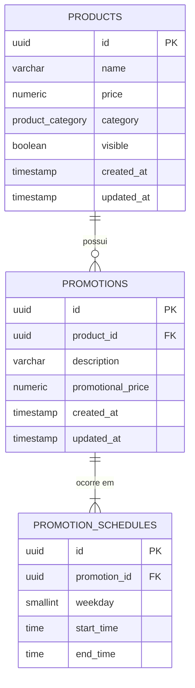
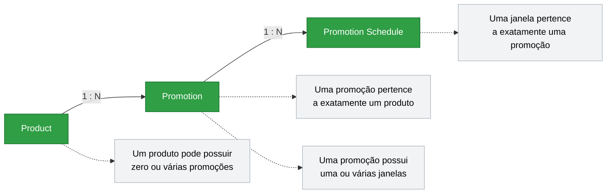
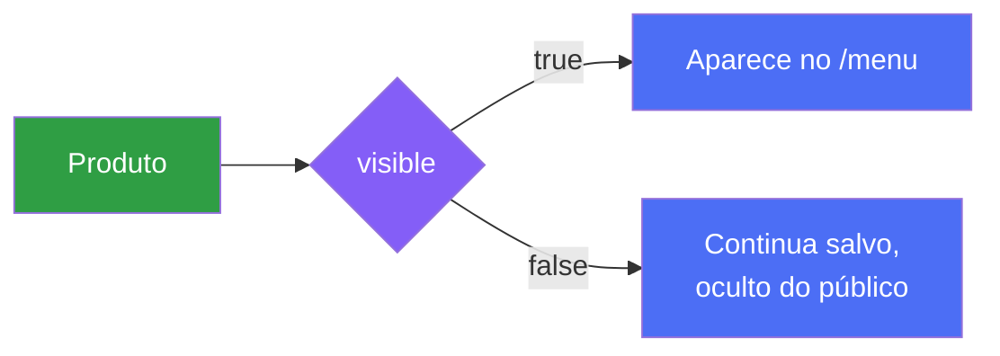
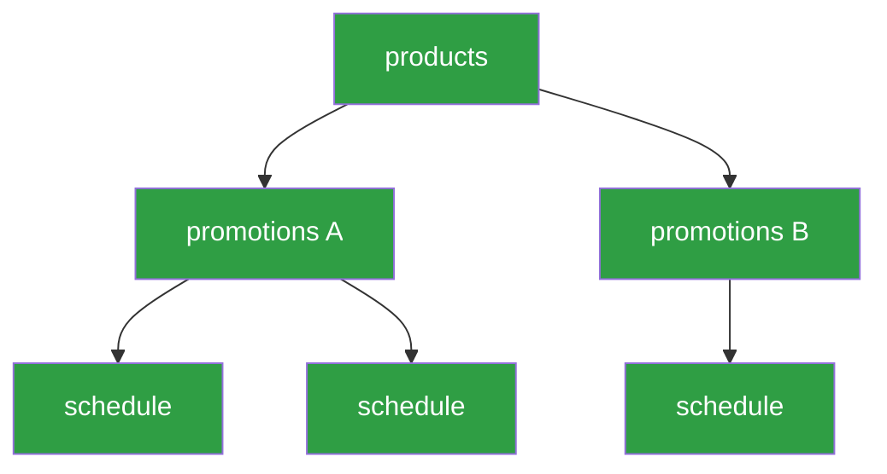
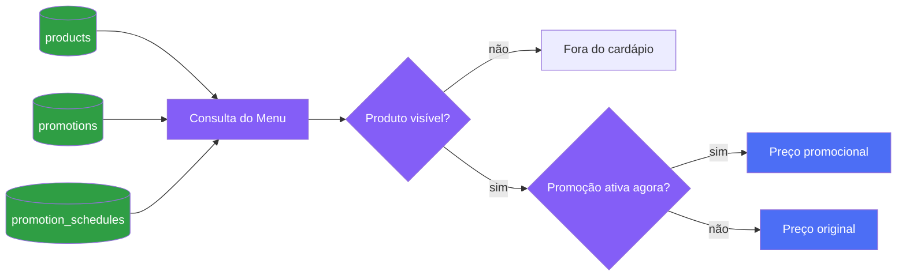

# ERD — Goomer Menu API

Este documento descreve o **modelo relacional** da Goomer Menu API: entidades, atributos, tipos, cardinalidades, constraints e regras de integridade.

Os fluxos de negócio e aplicação estão documentados separadamente:

- [`user-flow.md`](./user-flow.md) — o que o sistema faz, sem código
- [`data-flow.md`](./data-flow.md) — como uma requisição atravessa as camadas

Os diagramas seguem a mesma convenção de cor do [`README.md`](./README.md): 🟢 verde para dado persistido, 🟣 roxo para regra/decisão, 🔵 azul para o resultado exposto ao cliente, 🟠/🔴 laranja e vermelho para pontos de atenção e exclusão.

---

## Visão geral



## Cardinalidades



| Relação | Regra |
|---|---|
| Product → Promotion | Um produto pode possuir zero ou várias promoções |
| Promotion → Product | Uma promoção pertence a exatamente um produto |
| Promotion → Schedule | Uma promoção pode ter uma ou várias janelas de dia/horário — cada ocorrência é um registro em `promotion_schedules` |
| Schedule → Promotion | Cada janela pertence a exatamente uma promoção |

---

## 1. `products`

Representa os produtos cadastrados pelo restaurante.

| Campo | Tipo PostgreSQL | Restrições | Descrição |
|---|---|---|---|
| `id` | `UUID` | `PRIMARY KEY` | Identificador único |
| `name` | `VARCHAR` | `NOT NULL` | Nome do produto |
| `price` | `NUMERIC(10,2)` | `NOT NULL`, `CHECK (price > 0)` | Preço original |
| `category` | `product_category` | `NOT NULL` | Categoria do produto |
| `visible` | `BOOLEAN` | `NOT NULL DEFAULT TRUE` | Define se aparece no `/menu` |
| `created_at` | `TIMESTAMPTZ` | `NOT NULL DEFAULT now()` | Data de criação |
| `updated_at` | `TIMESTAMPTZ` | `NOT NULL DEFAULT now()` | Data da última alteração |

> **`TIMESTAMPTZ`, não `TIMESTAMP`, para colunas de auditoria.** `created_at`/`updated_at` representam um instante absoluto no tempo ("isso aconteceu às 14:32 UTC"), então precisam de fuso embutido para não ambiguar em queries feitas de máquinas com `TZ` diferente. Isso é conceitualmente diferente do `TIME` usado em `promotion_schedules.start_time`/`end_time`, que representa "18h no relógio de parede do restaurante" — um horário recorrente, não um instante. Usar `TIMESTAMPTZ` aqui **não** implementa timezone por restaurante (isso continua fora do MVP); é só a prática padrão de banco para timestamps de auditoria, independente dessa outra decisão.


Representada por um `ENUM` do PostgreSQL — o domínio tem um conjunto fechado e definido pelo próprio desafio, então um enum impede que `"bebida"`, `"Bebidas"`, `"DRINK"` e `"bebidass"` acabem representando a mesma coisa de formas diferentes no banco.

| Enum | Categoria |
|---|---|
| `STARTER` | Entradas |
| `MAIN_COURSE` | Pratos principais |
| `DESSERT` | Sobremesas |
| `BEVERAGE` | Bebidas |

### Preço

`NUMERIC(10,2)`, nunca `FLOAT` — operações financeiras exigem representação decimal exata (`FLOAT` introduz erro de arredondamento binário em valores como `0.10`, o tipo de bug que aparece só depois de milhares de transações).

### Visibilidade



`visible = true` é o padrão. Um produto com `visible = false` continua existindo e sendo administrável — só não aparece na projeção pública.

---

## 2. `promotions`

Representa uma promoção associada a um produto.

| Campo | Tipo PostgreSQL | Restrições | Descrição |
|---|---|---|---|
| `id` | `UUID` | `PRIMARY KEY` | Identificador único |
| `product_id` | `UUID` | `NOT NULL`, `FOREIGN KEY → products.id` | Produto relacionado |
| `description` | `VARCHAR` | `NOT NULL` | Descrição da promoção |
| `promotional_price` | `NUMERIC(10,2)` | `NOT NULL`, `CHECK (promotional_price > 0)` | Preço durante a promoção |
| `created_at` | `TIMESTAMPTZ` | `NOT NULL DEFAULT now()` | Data de criação |
| `updated_at` | `TIMESTAMPTZ` | `NOT NULL DEFAULT now()` | Data da última alteração |

Cardinalidade: `products (1) ── (N) promotions`. Um produto pode acumular várias promoções ao longo do tempo — inclusive vencidas ou fora de vigência, que continuam no histórico.

> Note que **não há** `CHECK (promotional_price < price)` — como registrado no `README.md`, essa é uma decisão de domínio nossa que não foi exigida pelo desafio, e por ora só validamos `promotional_price > 0`.

### Exclusão do produto

FK com `ON DELETE CASCADE`:


Decisão tomada aqui (resolve o ponto que estava em aberto no `README.md`): excluir um produto excluir em cascata suas promoções e janelas. Não haverá bloqueio de exclusão nem promoção órfã.

---

## 3. `promotion_schedules`

Representa **quando** uma promoção está ativa. Separar horários da promoção evita duplicar descrição e preço a cada janela:

```text
Happy Hour — R$ 6,00
├── quarta   18:00 → 20:00
├── sexta    18:00 → 22:00
└── sábado   16:00 → 20:00
```

A promoção existe uma vez; as três ocorrências acima são três registros em `promotion_schedules`.

| Campo | Tipo PostgreSQL | Restrições | Descrição |
|---|---|---|---|
| `id` | `UUID` | `PRIMARY KEY` | Identificador único |
| `promotion_id` | `UUID` | `NOT NULL`, `FOREIGN KEY → promotions.id` | Promoção relacionada |
| `weekday` | `SMALLINT` | `NOT NULL`, `CHECK (weekday BETWEEN 0 AND 6)` | Dia da semana |
| `start_time` | `TIME` | `NOT NULL` | Início da janela |
| `end_time` | `TIME` | `NOT NULL`, `CHECK (end_time > start_time)` | Fim da janela |

### Dias da semana

| Valor | Dia |
|---:|---|
| `0` | Domingo |
| `1` | Segunda-feira |
| `2` | Terça-feira |
| `3` | Quarta-feira |
| `4` | Quinta-feira |
| `5` | Sexta-feira |
| `6` | Sábado |

### Horários

Tipo nativo `TIME`, não `VARCHAR` — a API recebe e devolve `HH:mm`, mas o banco armazena como tipo temporal para permitir comparação e ordenação corretas (`'18:00' BETWEEN '17:00' AND '20:00'` funciona certo com `TIME`; como string, `'9:00' > '18:00'` já quebraria por comparação lexicográfica).

### Regras da janela

| Validação | Onde mora | Exemplo |
|---|---|---|
| `end_time > start_time` | Constraint no banco (estrutural) **e** Service (mensagem de erro amigável) | `18:00 → 17:00` ❌ |
| Duração ≥ 15 minutos | Service (é regra de negócio, não estrutural) | `18:00 → 18:10` ❌ · `18:00 → 18:15` ✅ · `18:07 → 18:22` ✅ |

A constraint do banco existe como **último cinto de segurança** contra dado inconsistente (ex.: um script de seed ou uma migration futura que insira direto no banco); a regra de negócio completa (os 15 minutos) mora no Service porque não é algo que faça sentido expressar como `CHECK` simples sem tornar a migration difícil de ler.

### Exclusão da promoção

FK com `ON DELETE CASCADE` — ao excluir uma `promotion`, todas as suas `promotion_schedules` somem junto. Nenhuma janela fica órfã.

---

## Integridade referencial — visão consolidada



```text
products
    │ ON DELETE CASCADE
    ▼
promotions
    │ ON DELETE CASCADE
    ▼
promotion_schedules
```

Nenhuma FK pode ficar apontando para um registro inexistente.

---

## Modelo relacional (referência para a migration)

```text
products
├── id                  UUID PK DEFAULT gen_random_uuid()
├── name                VARCHAR NOT NULL
├── price               NUMERIC(10,2) NOT NULL CHECK (price > 0)
├── category            product_category NOT NULL
├── visible             BOOLEAN NOT NULL DEFAULT TRUE
├── created_at          TIMESTAMPTZ NOT NULL DEFAULT now()
└── updated_at          TIMESTAMPTZ NOT NULL DEFAULT now()

promotions
├── id                  UUID PK DEFAULT gen_random_uuid()
├── product_id          UUID NOT NULL REFERENCES products(id) ON DELETE CASCADE
├── description         VARCHAR NOT NULL
├── promotional_price   NUMERIC(10,2) NOT NULL CHECK (promotional_price > 0)
├── created_at          TIMESTAMPTZ NOT NULL DEFAULT now()
└── updated_at          TIMESTAMPTZ NOT NULL DEFAULT now()

promotion_schedules
├── id                  UUID PK DEFAULT gen_random_uuid()
├── promotion_id        UUID NOT NULL REFERENCES promotions(id) ON DELETE CASCADE
├── weekday             SMALLINT NOT NULL CHECK (weekday BETWEEN 0 AND 6)
├── start_time          TIME NOT NULL
└── end_time            TIME NOT NULL CHECK (end_time > start_time)
```

### Índices recomendados

A consulta mais frequente do sistema — `GET /menu` — filtra `products` por visibilidade e casa `promotion_schedules` por dia/horário. Sem índice, isso vira `seq scan` na tabela de horários a cada request:

```sql
CREATE INDEX idx_products_visible ON products (visible);
CREATE INDEX idx_promotion_schedules_lookup ON promotion_schedules (weekday, start_time, end_time);
CREATE INDEX idx_promotions_product_id ON promotions (product_id);
```

`idx_promotions_product_id` também acelera o `ON DELETE CASCADE` — sem ele, o Postgres varre `promotions` inteira para achar filhos toda vez que um produto é excluído.

---

## Como o modelo alimenta o cardápio



`/menu` é uma projeção desses três dados — não existe tabela própria para ele.

---

## Decisões ainda em aberto

### 1. Promoções simultâneas do mesmo produto

O modelo permite duas promoções ativas do mesmo produto ao mesmo tempo:

```text
Promotion A — quarta 18:00→20:00 — R$ 8,00
Promotion B — quarta 19:00→21:00 — R$ 6,00
```

Às 19:30 de quarta, as duas estão ativas e o desafio não diz qual prevalece. Opções possíveis: impedir sobreposição na criação (constraint `EXCLUDE` com `btree_gist`, ou validação no Service), sempre aplicar o menor preço, ou definir prioridade explícita por ordem de criação. **Nenhuma será assumida silenciosamente** — decidir antes de implementar `POST /promotions` e `GET /menu`.

### 2. Janela que atravessa a meia-noite

`CHECK (end_time > start_time)` bloqueia por design uma janela como `sexta 22:00 → sábado 02:00` — cenário real para bar/balada, mas não mencionado no desafio. Duas saídas possíveis: manter a restrição (janelas noturnas viram duas linhas, uma terminando `23:59` na sexta e outra começando `00:00` no sábado) ou remover o `CHECK` e mover toda a lógica de comparação para o Service. **Não implementaremos isso a menos que decidamos suportar o caso** — fica registrado aqui para não ser esquecido se um restaurante de verdade pedir.

---

## Decisões fora do MVP

| Item | Status |
|---|---|
| `display_order` em `products` | Não existe nesta versão — só entra se a ordenação (opcional) for implementada |
| `restaurants.timezone` | Entidade `Restaurant` não existe nesta versão — só entra se o suporte a timezone (opcional) for implementado |

Qualquer uma das duas, quando decidida, atualiza este ERD **antes** da migration correspondente — nunca depois.

---

## Resumo das decisões

| Decisão | Escolha |
|---|---|
| Identificadores | `UUID` |
| Preços | `NUMERIC(10,2)` |
| Categoria | `ENUM` |
| Timestamps de auditoria | `TIMESTAMPTZ` |
| Visibilidade | `BOOLEAN DEFAULT TRUE` |
| Dias da semana | `SMALLINT 0–6` |
| Horários | PostgreSQL `TIME` |
| Product → Promotion | `1:N` |
| Promotion → Schedule | `1:N` |
| Delete Product | `CASCADE` |
| Delete Promotion | `CASCADE` |
| Ordenação | Fora do MVP |
| Timezone | Fora do MVP |
| Promoções simultâneas | **Pendente** |
| Janela cruzando meia-noite | **Pendente** |