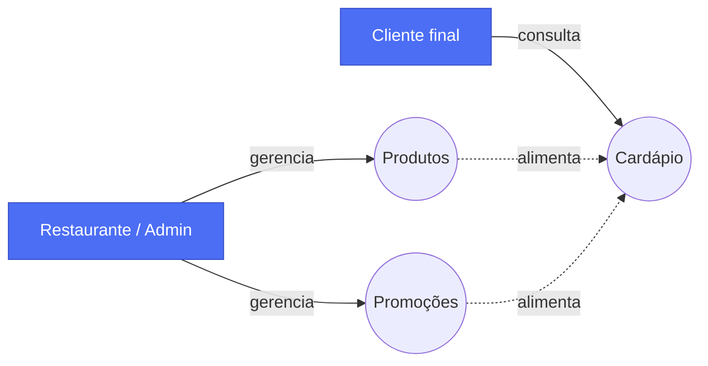
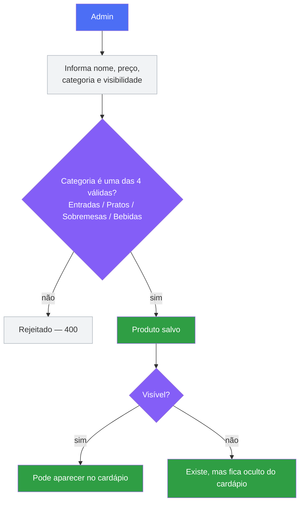
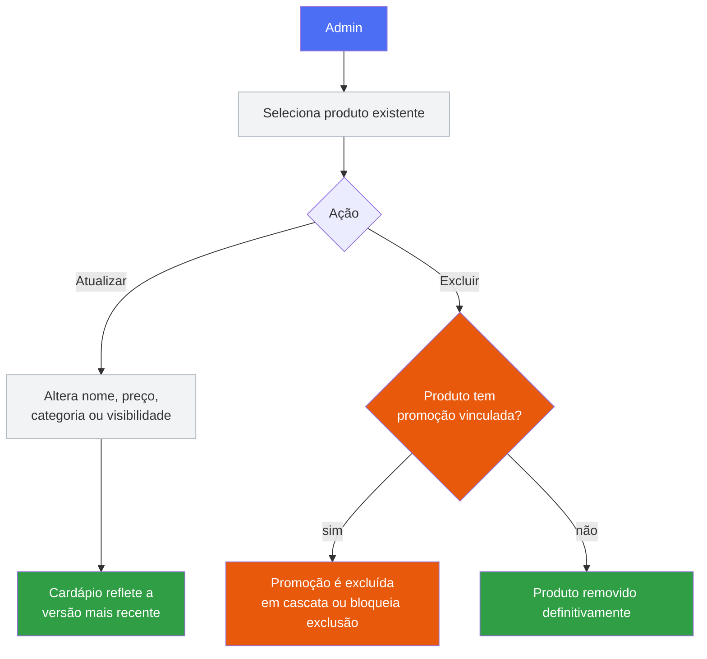
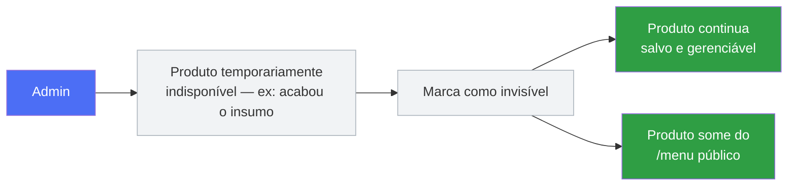
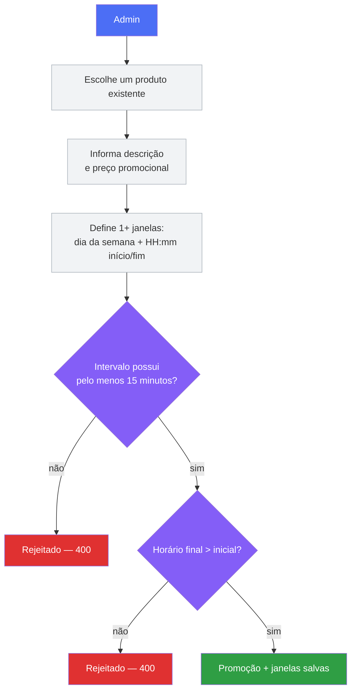
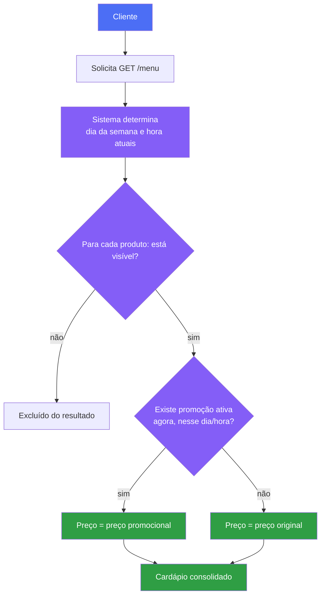
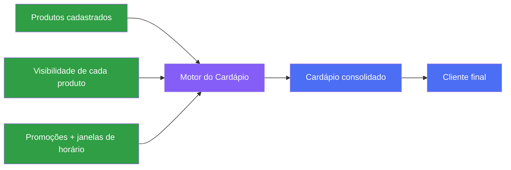
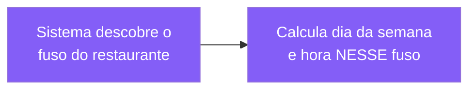

# User Flow — Goomer Menu API

Este documento descreve o sistema pela ótica do **negócio**: o que cada ator consegue fazer e qual resultado ele espera. Não há código nem SQL aqui — para isso, veja [`data-flow.md`](./data-flow.md).

## Atores

**Admin** é quem opera o restaurante: cria e mantém o catálogo. **Cliente** só enxerga o resultado final — nunca interage diretamente com `products` ou `promotions`, apenas com a projeção consolidada `/menu`.

Essa distinção importa porque as duas APIs têm contratos diferentes:

| | API de gestão (`/products`, `/promotions`) | API de cardápio (`/menu`) |
|---|---|---|
| Quem consome | Admin / painel do restaurante | Cliente final |
| Mostra produtos invisíveis? | Sim | Não |
| Mostra preço original e promocional? | Sim, os dois | Só o preço **vigente agora** |
| Depende de horário atual? | Não | Sim — é o dado mais importante da resposta |

---

## Fluxo 1 — Cadastrar produto

**Resultado esperado:** o produto passa a existir independentemente da visibilidade — visibilidade decide se ele *aparece* no cardápio, não se ele *existe*.

---

## Fluxo 2 — Atualizar ou excluir produto

> **Decisão de projeto a documentar no README principal:** exclusão em cascata (`ON DELETE CASCADE` nas promoções do produto) ou bloqueio (`409 Conflict` se houver promoção vinculada). Qualquer uma é aceitável — o que não pode acontecer é uma promoção órfã apontando para um produto inexistente.

---

## Fluxo 3 — Ocultar produto (visibilidade)

**Regra de negócio:** ocultar ≠ excluir. É reversível, não perde histórico e não afeta promoções já cadastradas — só a exibição pública.

---

## Fluxo 4 — Criar promoção

> **Decisão de domínio ainda em aberto:** o enunciado não exige que `promotionalPrice` seja menor que o preço original do produto — só pede que exista um preço promocional. Por ora validamos apenas `promotionalPrice > 0`. Se decidirmos impor `promotionalPrice < product.price`, isso é uma regra de negócio nossa, não um requisito do desafio, e deve ser documentada como tal no README principal antes de virar validação obrigatória.

**Exemplo real:** produto *Chopp* (R$ 12,00), promoção *"Happy Hour"*, preço promocional R$ 6,00, ativa **quarta-feira das 18:00 às 20:00**. Uma mesma promoção pode ter várias janelas (ex.: sexta e sábado à noite) sem duplicar a promoção inteira — cada janela é um registro próprio ligado à mesma promoção.

---

## Fluxo 5 — Cliente consulta o cardápio

**Resultado esperado:** o cliente recebe uma lista pronta para renderizar — sem produtos ocultos, com o preço que realmente vale *agora*.

---

## Visão consolidada

**Resumo de negócio:**
- **Admin** alimenta o sistema (produtos, visibilidade, promoções).
- **Cliente** só consome a projeção final — nunca vê a estrutura interna.
- O **Menu** não é uma tabela, é uma *decisão calculada em tempo real* a partir de produto + visibilidade + promoção + horário.

---

## Evoluções opcionais

Estas funcionalidades não fazem parte do MVP documentado acima e só entram se decidirmos implementá-las — o desafio as trata como opcionais, e a documentação reflete apenas o que já está decidido.

### Timezone por restaurante

Hoje o domínio não possui a entidade `Restaurant`, então "hora atual" é calculada no fuso do próprio servidor. Caso essa funcionalidade seja implementada, o fluxo do `/menu` passa a ter um passo adicional **antes** de determinar dia/hora:

Isso evita o bug silencioso de um restaurante em Manaus (UTC-4) e outro em Fernando de Noronha (UTC-2) terem "quarta-feira 18h" resolvido em momentos absolutos diferentes — sem erro nenhum, só promoção ligando/desligando na hora errada.

### Ordenação de produtos

Também não implementada ainda. Quando decidida, o fluxo de "listar produtos" ganha uma ordem explícita controlável pelo Admin — documentaremos aqui assim que a coluna e a regra existirem.